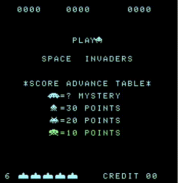

# Taito 8080 Emulator

Emulator for taito 8080 machines, such as space invaders, lunar rescue and seawolf. Uses my [intel 8080 emulator](https://github.com/blr-ophon/8080nemu) library, C and SDL2 for graphics. Currently only space invaders works perfectly.


## Screenshots




## Requirements

- sdl2
- sdl2_image


## Building
Clone the project
```bash
  git clone --recurse-submodules https://github.com/blr-ophon/ntaito8080
```
Compile using:

```bash
  cd ntaito8080
  make
```
## Running

Provide a rom to the executable:

```bash
  ./ntaito8080 <rom>
```

Roms can be found in the roms folder


## Usage

Keys are assigned to '1','2','space','enter' and arrow keys. Behavior change according to game

Use `esc` to quit 

